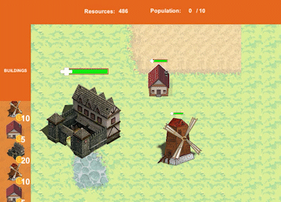
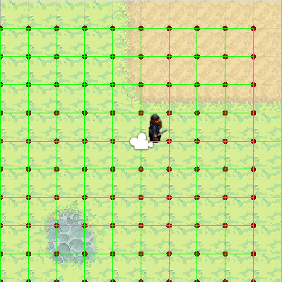
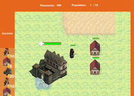
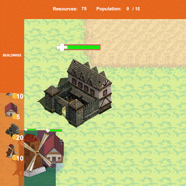
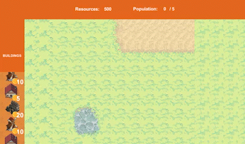

# StrategyGame_2DPlatformer
### Introduction
This repository contains a primitive 2D strategy game with 3 types of buildings and 3 types of soldiers, with basic functionality such as selection, movement attack, and taking damage.

### Run The Repo
##### From Unity Editor
git clone https://github.com/tahirbey48/StrategyGame_2DPlatformer.git

Open the project folder with Unity Editor
##### Playable Build
Click StrategyGame_2DPlatformer.exe at Build_Windows folder

### Units
##### Buildings
This game contains 3 types of buildings, 
* House, gives population to create more soldiers, has 20 health points.
* Mill, gives some amount of money per second, has 50 health points.
* Barracks, produces soldiers, has 100 health points.

##### Soldiers 
This game contains 3 types of soldiers,
* Swordsman, costs 10 coins, has 10 HP, 2 attack damage, occupies 1 population
* Spearman costs 10 coins, has 10 HP, 5 attack damage, occupies 1 population
* Knight costs 20 coins, has 10 HP, 10 attack damage, occupies 2 population

### Functionality
##### Selection
All buildings and soldiers can be selected in the game.

##### Movement
Tilemap to graph - a tilemap to graph implementation is made.

In this implementation, each TileBase are stored in nodes of the graph. Possible paths are edges between the nodes.
To move the player, an AStar Pathfinding algorithm is implemented. The shortest path is adopted to move the player among unoccupied nodes.

##### Building placement
Place is highlighted for appropriate area

##### Attack
Selected soldiers will be able to attack with right click on a unit or building.
Soldiers and buildings should be destroyed when their hp is 0. 
Soldier attack a building or another soldier from the closest possible point.

##### Infinite Scrollview
A simple object pooling is adopted for infinite scroll view.

